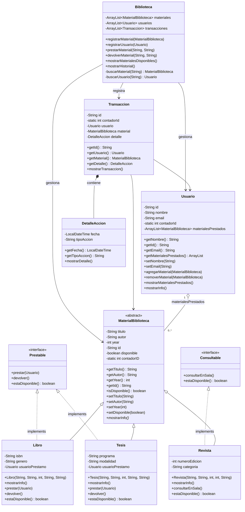

## Diagrama UML

```mermaid
classDiagram
    direction TB

    class MaterialBiblioteca {
        <<abstract>>
        -String titulo
        -String autor
        -int year
        -String id
        -boolean disponible
        -static int contadorID
        +getTitulo() String
        +getAutor() String
        +getYear() int
        +getId() String
        +isDisponible() boolean
        +setTitulo(String)
        +setAutor(String)
        +setYear(int)
        +setDisponible(boolean)
        +mostrarInfo()* 
    }

    class Prestable {
        <<interface>>
        +prestar(Usuario)
        +devolver()
        +estaDisponible() boolean
    }

    class Consultable {
        <<interface>>
        +consultarEnSala()
        +estaDisponible() boolean
    }

    class Libro {
        -String isbn
        -String genero
        -Usuario usuarioPrestamo
        +Libro(String, String, int, String, String)
        +mostrarInfo()
        +prestar(Usuario)
        +devolver()
        +estaDisponible() boolean
    }

    class Tesis {
        -String programa
        -String modalidad
        -Usuario usuarioPrestamo
        +Tesis(String, String, int, String, String)
        +mostrarInfo()
        +prestar(Usuario)
        +devolver()
        +estaDisponible() boolean
    }

    class Revista {
        -int numeroEdicion
        -String categoria
        +Revista(String, String, int, int, String)
        +mostrarInfo()
        +consultarEnSala()
        +estaDisponible() boolean
    }

    class Usuario {
        -String id
        -String nombre
        -String email
        -static int contadorId
        -ArrayList~MaterialBiblioteca~ materialesPrestados
        +getNombre() String
        +getId() String
        +getEmail() String
        +getMaterialesPrestados() ArrayList
        +setNombre(String)
        +setEmail(String)
        +agregarMaterial(MaterialBiblioteca)
        +removerMaterial(MaterialBiblioteca)
        +mostrarMaterialesPrestados()
        +mostrarInfo()
    }

    class DetalleAccion {
        -LocalDateTime fecha
        -String tipoAccion
        +getFecha() LocalDateTime
        +getTipoAccion() String
        +mostrarDetalle()
    }

    class Transaccion {
        -String id
        -static int contadorId
        -Usuario usuario
        -MaterialBiblioteca material
        -DetalleAccion detalle
        +getId() String
        +getUsuario() Usuario
        +getMaterial() MaterialBiblioteca
        +getDetalle() DetalleAccion
        +mostrarTransaccion()
    }

    class Biblioteca {
        -ArrayList~MaterialBiblioteca~ materiales
        -ArrayList~Usuario~ usuarios
        -ArrayList~Transaccion~ transacciones
        +registrarMaterial(MaterialBiblioteca)
        +registrarUsuario(Usuario)
        +prestarMaterial(String, String)
        +devolverMaterial(String, String)
        +mostrarMaterialesDisponibles()
        +mostrarHistorial()
        -buscarMaterial(String) MaterialBiblioteca
        -buscarUsuario(String) Usuario
    }

    %% Herencia
    MaterialBiblioteca <|-- Libro
    MaterialBiblioteca <|-- Tesis
    MaterialBiblioteca <|-- Revista

    %% Interfaces
    Prestable <|.. Libro : implements
    Prestable <|.. Tesis : implements
    Consultable <|.. Revista : implements

    %% Agregación — Usuario tiene materiales pero existen independiente
    Usuario "1" o-- "0..*" MaterialBiblioteca : materialesPrestados

    %% Composición — DetalleAccion no existe sin Transaccion
    Transaccion *-- DetalleAccion : contiene

    %% Asociaciones
    Transaccion --> Usuario
    Transaccion --> MaterialBiblioteca
    Biblioteca --> MaterialBiblioteca : gestiona
    Biblioteca --> Usuario : gestiona
    Biblioteca --> Transaccion : registra
```
